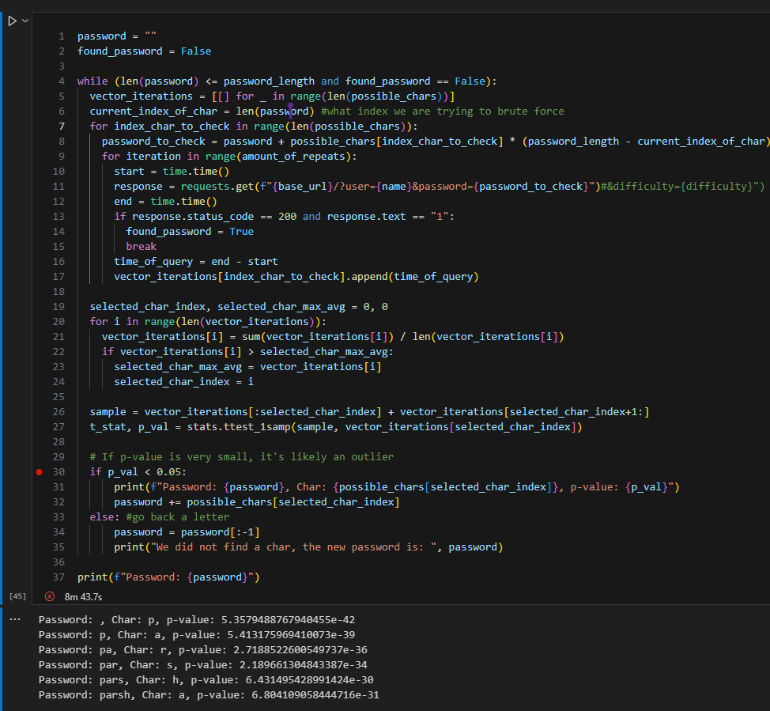

# Report for Attacks on Secure Implmentations
### First try

In this try, we implmented the t-test, and did 3 repeats per character. we saw it takes a lot of time, and we figured that we have two way to improve:
- variable amount of repeats, e.g the amount of repeats changes per the p-value
- perform t-test while before we finish all the characters
- add threads. the threads will calculate the avg and the t-test
